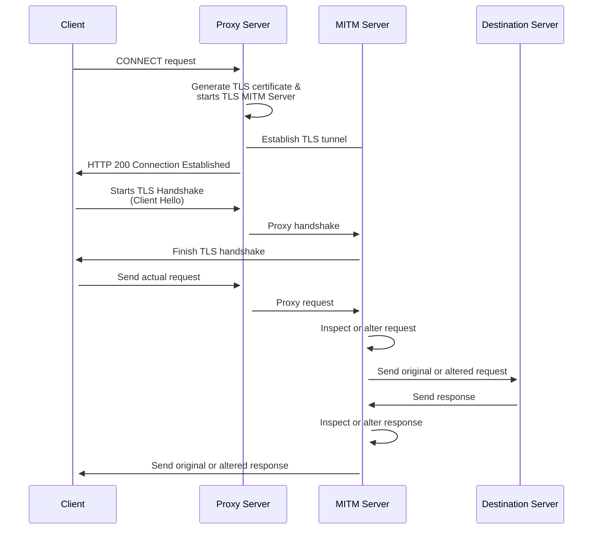

MidProxyEngine v0.0.1
-------------
⚠️ This is still in testing ⚠️

MidProxyEngine is a package for setting up a configurable, SSL/TLS-capable man-in-the-middle proxy server. It was created as the backend behind [MidProxy](https://github.com/caio-ishikawa/midproxy). 

## Installation
```sh
go get github.com/caio-ishikawa/midproxy_engine
```

## How To Use
In order to start the proxy server over TLS, a ```.crt``` and a ```.key``` file need to be created in the source directory of the project, and the certificate needs to be added to the OS's trust store. Without this, the MITM certificates would not be accepted by the client.

1. Generate ```.key``` file:
```openssl genpkey -algorithm RSA -out root.key```
2. Generate ```.crt``` file:
```openssl req -new -x509 -key root.key -out root.crt```
3. Add to trust store:
*MacOS*
    ```openssl req -new -x509 -key root.key -out root.crt```

*Debian/Ubuntu*
    1. Copy root certificate to ca-certificates directory:
    ```sudo cp root.crt /usr/local/share/ca-certificates/```
    2. Update the CA certificates:
    ```sudo update-ca-certificates```

*Fedora/CentOS*
    1. Copy root certificate to ca-trust/source/achors:
    ```sudo cp root.crt /etc/pki/ca-trust/source/anchors/```
    2. Update the CA certificates:
    ``` sudo update-ca-trust```

### Simple example of intercepting HTTPS request:
```go
package main

import (
    "log"

    midproxy "github.com/caio-ishikawa/midproxy_engine"
)
// Simple onRequest hook that makes original request to target server, logs it, and responds with a string 
func onRequest(w http.ResponseWriter, r *http.Request) {
	newURL, err  := url.Parse("https://" + r.Host + r.URL.String())
	if err != nil {
		return
	}

	newReq := new(http.Request)
	newReq.URL = newURL
	newReq.Header = r.Header
	newReq.Body = r.Body
	newReq.Method = r.Method

	_, err = http.DefaultClient.Do(newReq)
	if err != nil {
		log.Println("Error making request: ", err)
		return
	}

	log.Println("Response: ", res)
	w.Write([]byte("Test"))
}

// Continuously reads strings from a channel and logs them
func handleLogs(p midproxy.Proxy) {
	for {
		data := <- p.LogChan
		log.Println(data)
	}
}

func main() {
    // Starts proxy with debug mode, and onRequest function
	p, err := midproxy.NewProxy(true, onRequest)
	if err != nil {
		panic(err)
	}

    // Logs are handled in a separate goroutine
	go handleLogs(p)

    // Starts proxy server
	p.StartProxy()
}
```

How It Works
------------
## HTTPS 
A normal forward or backward proxy would create an encrypted TLS tunnel between the client and the destination server. All requests from the client would go through the tunnel, but the TLS handshake happens between the client and the destination server, which means that the proxy server will not be able to decrypt the data being sent from the client or the server.

IntruderProxy works by creating a man-in-the-middle server, using dynamically generated TLS certificates in order to decrypt and encrypt data to and from the client. This sub-server acts as the destination server, and the TLS handshake happens between it and the client. Which means that the tunnel that would generally be established between the client and the destination server is now established between the client and the man-in-the-middle-server. With this encrypted tunnel established, MidProxyEngine is able to read and write encrypted data to and from the client as if it was the destination.

The logic for the request interception can be configured with the onReq method for the proxy. 



## HTTP
No sub-server is started during the interception of a HTTP request, since there is no encryption. Instead, the original request is passed to the onReq method, and the response is returned to the original client conneciton. 

## WebSockets (TODO)

